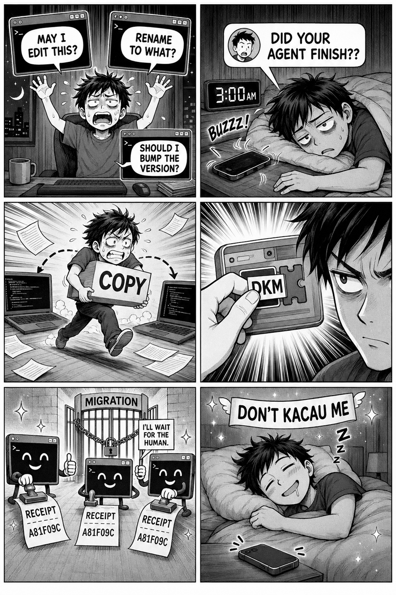
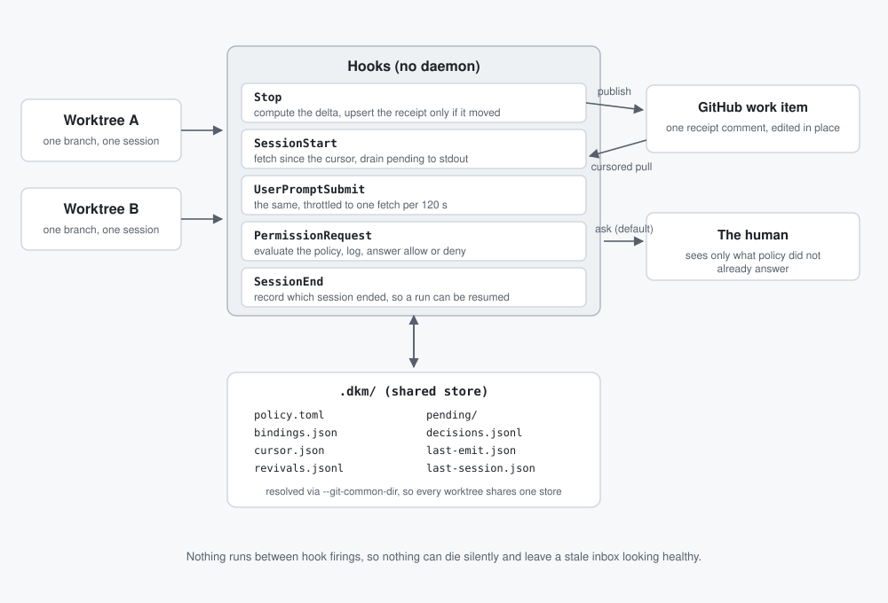
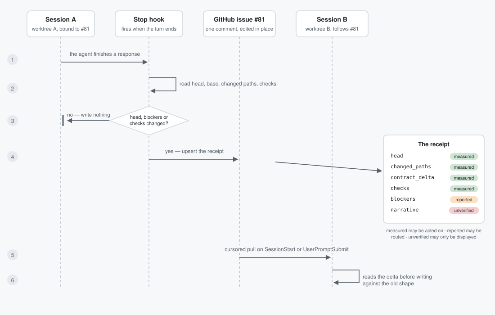

# Don't Kacau Me


**A Claude Code plugin that stops your AI coding sessions from interrupting you.**

_Kacau_ is Malay for "to disturb". The name is the product: don't bother me.

> No human courier. No human decision queue. No manufactured consent.

## Table of contents

<details>
  <summary>Expand</summary>
  <ol>
    <li><a href="#is-this-for-you">Is this for you?</a></li>
    <li><a href="#the-two-problems">The two problems</a></li>
    <li><a href="#what-dkm-does-about-them">What DKM does about them</a></li>
    <li><a href="#the-rule-that-keeps-this-safe">The rule that keeps this safe</a></li>
    <li><a href="#getting-started">Getting started</a></li>
    <li><a href="#the-five-commands">The five commands</a></li>
    <li><a href="#what-it-looks-like-in-practice">What it looks like in practice</a></li>
    <li><a href="#what-dkm-cannot-do">What DKM cannot do</a></li>
    <li><a href="#under-the-hood">Under the hood</a></li>
    <li><a href="#architecture">Architecture</a></li>
    <li><a href="#configuration">Configuration</a></li>
    <li><a href="#tech-stack">Tech stack</a></li>
    <li><a href="#repository-layout">Repository layout</a></li>
    <li><a href="#contributing">Contributing</a></li>
    <li><a href="#licence">Licence</a></li>
    <li><a href="#how-work-ships">How work ships</a></li>
  </ol>
</details>

## Is this for you?

You run **more than one Claude Code session at the same time** — usually one per git worktree, which is just a second
checkout of your repository you can work in simultaneously. One session fixes a bug, another builds a feature.

That works. But two new problems show up, and they get **worse the better your agents get**.

If you only ever run one session at a time, you do not need DKM yet.

## The two problems

### 1. You become the courier

Agent A finishes something. Agent B needs to know. Nothing connects them, so **you** read A's summary and paste it into
B.

Every time you do that, a fact becomes prose. It loses the commit it was true at, and nobody can check it any more.
Teammates have the same problem from outside: they message you to ask whether your agent finished, and the answer waits
until you wake up.

### 2. You become the queue

Every session stops and asks permission. _Run the formatter? Run the tests? Write this file?_

Three agents blocked on one person are all waiting on **your attention**, which makes you the slowest part of your own
setup. Most of those questions are not judgement calls. They are things you already decided a hundred times.

## What DKM does about them

### For the courier problem: receipts

When a session finishes a turn **and the repository actually moved**, DKM posts a comment on the GitHub issue or PR that
session is working on.

Not a summary. A **receipt**: the exact commit SHA, which files changed, whether CI passed. One comment per work item,
edited in place, so it never becomes a wall of noise.

The important part is that every field is labelled by **how much you can trust it**:

| Kind           | Where it came from                    | What you may do with it               |
| -------------- | ------------------------------------- | ------------------------------------- |
| **measured**   | `git` and `gh`, so an actual fact     | Act on it                             |
| **reported**   | The agent's claim about its own state | Route it, never treat it as repo fact |
| **unverified** | The agent's prose                     | Display it, nothing more              |

That separation is the point: an agent's opinion can never quietly become a repository fact.

### For the queue problem: a policy you write once

You write a small file, `.dkm/policy.toml`, saying what you have already decided. _Running tests is fine. Editing files
under `src/` is fine._ Those prompts stop reaching you.

Every decision made on your behalf is logged, so you can read back exactly what happened while you slept.

### What about `--dangerously-skip-permissions`?

It solves the same annoyance by removing the question rather than answering it, and a lot of people running several
sessions already use it. The difference is what happens to the prompts you did **not** want to skip.

|                                           | `--dangerously-skip-permissions` | A DKM policy                               |
| ----------------------------------------- | -------------------------------- | ------------------------------------------ |
| Routine prompts                           | gone                             | gone                                       |
| `rm -rf`, `git push`, a migration, `.env` | **also gone**                    | still stop you                             |
| A write outside this worktree             | **allowed**                      | denied                                     |
| What was decided while you slept          | nothing recorded                 | every decision, with the rule that made it |

**DKM only decides when Claude Code asks it to.** A session that answers its own prompts never sends DKM the question,
so a committed policy sits unused. That covers `--dangerously-skip-permissions` and any non-asking `--permission-mode`,
including one set as `permissions.defaultMode` in your settings, which applies to every session you start.

Since v0.4.1 a session in one of those modes says so at startup rather than looking like a policy that is working.

## The rule that keeps this safe

> Auto-answering may **execute a decision you already made**. It must never **invent one**.

Some things always reach you no matter what your policy says. These rules run **before** your allowances and **cannot be
switched off from the policy file**:

| If the action would…                                    | DKM answers |
| ------------------------------------------------------- | ----------- |
| Delete data, drop a column, or write a migration        | ask you     |
| Post, publish, deploy, send, or open a network write    | ask you     |
| Spend money                                             | ask you     |
| Touch a lockfile, an exported API surface, or `.env`    | ask you     |
| Touch anything under `.dkm/`, which is the grant itself | ask you     |
| Write outside the session's own worktree                | **deny**    |
| Match a rule you wrote, and trip none of the above      | allow       |

`.dkm/` is on that list so an agent cannot widen its own permissions by editing the file that grants them.

**That asymmetry is the whole pitch: the boring prompts vanish, the dangerous ones do not.**



## Getting started

**You need** [Claude Code](https://code.claude.com/docs/en/plugins) and [Bun](https://bun.sh/). For receipts you also
need an authenticated [`gh`](https://cli.github.com/) and a repository whose work you track in GitHub issues or PRs; for
the policy half you need neither.

1. **Install the plugin.** No clone needed.

   ```bash
   claude plugin marketplace add TolongLabs/dont-kacau-me
   claude plugin install dont-kacau-me@tolonglabs
   ```

   To try it for one session without installing, clone the repository and use
   `claude --plugin-dir /absolute/path/to/dont-kacau-me` instead. Adding a local clone as a marketplace works too, but
   the trailing slash matters there: `claude plugin marketplace add ./`, never a bare `.`.

1. **Set it up in a repository.** Restart Claude Code so it loads the plugin, then run:

   ```text
   /dont-kacau-me:dkm-init
   ```

   This checks your prerequisites, writes a starter `.dkm/policy.toml` built from what the repository actually contains,
   and prints what just became automatic. Read the file it wrote, delete anything you did not mean to grant, and commit
   it. **That file is your grant**, so treat it as one: never copy a policy whose authority you do not intend to hand
   over.

   Nothing else is required. Your prompts stop arriving from here on, and this half works alone, in one session, with no
   GitHub issue.

1. **Only if you want receipts:** tell a session which work item it owns.

   ```text
   /dont-kacau-me:dkm-bind 12
   ```

   Receipts then publish themselves. This step needs an authenticated `gh` and a GitHub remote; step 2 does not.

## The five commands

| Command                                  | When you use it                                                        |
| ---------------------------------------- | ---------------------------------------------------------------------- |
| `/dont-kacau-me:dkm-init`                | Once per repository, to check prerequisites and write a starter policy |
| `/dont-kacau-me:dkm-bind 12`             | Once per worktree, to name the issue or PR its receipts belong to      |
| `/dont-kacau-me:dkm-follow 81`           | To be told when someone else's work item changes                       |
| `/dont-kacau-me:dkm-status`              | To see what happened overnight and every decision made for you         |
| `/dont-kacau-me:dkm-note blocker <text>` | When the agent hits a real judgement call and should not guess         |

Claude Code namespaces a plugin's commands, so every DKM command is typed as `/dont-kacau-me:<command>`, never
`/<command>`.

Re-running `dkm-init` is also how you diagnose a repository later. It never replaces a policy that already exists unless
you pass `--force`.

The usage-limit supervisor is not a slash command; it is a process you start yourself, described next.

### Surviving a usage limit

A long unattended run used to end the moment your usage limit was reached. Start it under the supervisor instead:

```bash
bun "${CLAUDE_PLUGIN_ROOT}"/src/cli.ts revive "work through issue 12" -- --effort high
```

When a run stops on a limit, it reads the reset time the server reported, waits, and **resumes the same session** so the
work continues instead of starting over. It waits; it never tries to dodge the limit. Every pause is recorded in
`.dkm/revivals.jsonl`.

This is the one part of DKM that is not a hook: a foreground process you start instead of `claude`. It is optional, and
nothing runs in the background when you are not running it.

## What it looks like in practice

Five situations DKM is built for. Expand whichever one sounds like your week.

<details>
<summary><b>1. Overnight handoff — skip the 3am ping</b></summary>

A teammate needs to know whether your agent finished before they can start. Without DKM they message you and wait. With
DKM the work item already carries the head SHA, changed paths and check results, so they read it instead of asking.

You did nothing to publish it. The first bound `Stop` wrote the receipt when the repository actually moved.

</details>

<details>
<summary><b>2. Contract change — warn a dependent session</b></summary>

Agent A alters a database schema on PR #81. Agent B is building against the old shape in another worktree and would
normally discover the mismatch at merge, after both sides have paid for it.

```text
/dont-kacau-me:dkm-follow 81
```

When #81 moves, B's next turn opens with the contract delta and the exact SHA it was observed at. B adapts before
writing the wrong code, and can re-read the source rather than trust prose. The two worktrees can even be on different
developers' machines, provided both have the repository and an authenticated `gh`.

</details>

<details>
<summary><b>3. Routine prompts — clear the decision queue</b></summary>

Three agents stop on three prompts that need no new judgement: run the formatter, run the tests, write a file under
`src/`. Each one is a context switch for you.

Write those grants once in `.dkm/policy.toml` and they stop arriving. A fourth prompt that touches a migration still
waits, because blast-radius rules run first.

</details>

<details>
<summary><b>4. Morning review — inspect the decision log</b></summary>

```text
/dont-kacau-me:dkm-status
```

Every autonomous decision appears with the rule that produced it, so the audit is a handful of lines rather than three
transcripts. A decision with no log entry is a bug, and the test suite fails on it.

</details>

<details>
<summary><b>5. Human judgement — report a blocker</b></summary>

An agent reaches a genuine judgement call: two viable designs, or a requirement nobody wrote down. It should not invent
your intent.

```text
/dont-kacau-me:dkm-note blocker Two viable shapes for the retry policy; needs a human call
```

The blocker rides the next receipt as **reported**, visibly separate from the measured fields, where you and your
teammates can see it without anyone being interrupted.

</details>

## What DKM cannot do

- **No live mid-turn delivery.** A session learns about a receipt when it starts or receives a prompt because ingest is
  a cursored pull on injection hooks. A supervised watch or cross-session messaging needs a lifecycle v1 does not have.
- **No cross-machine propagation beyond GitHub.** v1 uses one GitHub comment per work item and each checkout's local
  `.dkm/` state. Reaching a machine beyond what the repository carries is a v3 concern.
- **No inbound consent path.** Another Claude session cannot approve a prompt, and a relayed approval is untrusted.
  `decide()` accepts only permission input and policy, importing neither the pending store nor the GitHub client.
- **No learning precedent store yet.** v1 authority comes from human-written, committed policy, not accumulated
  inference or precedent.
- **No delivery receipt.** A queued event is removed when a session drains it. Nothing records whether the model acted,
  so an ignored injected delta looks identical to one it used.
- **No automatic stale-head check.** Ingest does not compare a publisher's observed SHA with the current remote head
  before rendering the receipt.
- **No enforced hop budget.** `rootId` and `hops` are written and shape-checked but never incremented, rejected or used
  for control flow.
- **Narrow ambient feed.** Ambient ingest sees issues and PRs from the updated-items query, with no separate @mention or
  base-branch CI source.

## Under the hood

Everything above is what you need to use DKM. The rest is how it works, for anyone extending it or reviewing it.
Implementation-level contracts, schemas and rationale live in [the technical reference](TRD.md).

## Architecture

DKM coordinates sessions through Claude Code hooks and has no daemon. Hook-driven receipt, ingest and permission work
never calls a model; the optional usage-limit supervisor is a foreground CLI process.



And the path one receipt takes, from the turn that produced it to the session that reads it:



The subsections below stay at the system-narrative level. Implementation contracts and rationale live in
[the technical reference](TRD.md).

<details>
<summary><b>The hook lifecycle</b></summary>

| Hook event          | DKM action                                              | Observable result                                  |
| ------------------- | ------------------------------------------------------- | -------------------------------------------------- |
| `Stop`              | Publish a baseline, then compare later tracked state    | Update one receipt only after a tracked delta      |
| `SessionStart`      | Pull repository updates and drain this worktree's queue | Inject available context, and a hint if unbound    |
| `UserPromptSubmit`  | Run the same pull with a rate limit, then drain         | Inject available context on a later prompt         |
| `PermissionRequest` | Evaluate policy, append a record and emit or defer      | Execute a prior grant or leave the prompt to human |
| `SessionEnd`        | Record the supplied session details                     | Leave a diagnostic resume ticket on disk           |

- `Stop` ends a response, not the work; after the baseline, unchanged tracked state produces no receipt.
- DKM registers no worktree lifecycle hook. Explicit binding lets the user choose the GitHub item a worktree owns.
- An unbound worktree publishes nothing, so `SessionStart` says so once, and only where a policy file exists.
- An unmatched permission or handler failure leaves the prompt to the human.
- Pull-based delivery injects queued context on session start or prompt submission, not when another session publishes.

</details>

<details>
<summary><b>Receipt delivery and tracking</b></summary>

A signal is queued only at the finest tier that claims it for one recipient and ingest.

| Tier         | Covers                                                   | Delivered as                                               |
| ------------ | -------------------------------------------------------- | ---------------------------------------------------------- |
| **Bound**    | The work item this worktree owns                         | Receipt summary: SHAs, contract paths, checks and blockers |
| **Followed** | Work items this session declared a dependency on         | The same receipt summary, labelled `followed`              |
| **Ambient**  | Other issues and PRs updated since the repository cursor | Headline and URL                                           |

- The current GitHub query returns updated issues and PRs; raw commits are not an ambient signal.
- DKM discards body fields before building a pending event.
- Separate @mention and base-branch CI feeds are not implemented.

</details>

<details>
<summary><b>The receipt schema</b></summary>

DKM edits one GitHub comment per work item in place instead of appending comments. Every field carries one of the three
trust kinds described under [what DKM does about them](#for-the-courier-problem-receipts); `measured` is sourced from
`git`, `gh` or counted local state, `reported` is asserted by the session about itself, and `unverified` is agent prose.

The receipt carries:

- GitHub item identity and a git range
- changed paths, check results and contract paths
- decision counts
- reported blockers
- unverified narrative
- an observation time

DKM does not read raw transcripts or tool output into a receipt. Only a note explicitly recorded through the CLI becomes
narrative.

Every receipt carries the head SHA at measurement time, but DKM does not compare it with the current remote head before
injection. The injected warning tells the session to re-read before acting if the head has moved.

</details>

<details>
<summary><b>Policy and authority</b></summary>

> Auto-answering may **execute an existing decision**. It must never **manufacture intent or consent**.

Installing DKM and writing `.dkm/policy.toml` is the prior human grant. DKM may decide within that committed policy in
the installer's own sessions. `src/decide.ts` receives only the current permission input and parsed policy; it imports
neither the pending-event store nor the GitHub client.

`PermissionRequest` evaluates:

1. Mechanical blast-radius rules.
1. Explicit policy allow rules for paths, tools and commands granted in advance.
1. The default human path for anything unmatched: `ask`.

The table is mechanical rather than model-assessed because agents are poor at self-assessing risk. `.dkm/` is protected
because an agent that can edit its grant can widen that authority without anyone deciding to. This is the exact form of
the plain-English table in [the rule that keeps this safe](#the-rule-that-keeps-this-safe):

| Recognised input                                                           | Result  |
| -------------------------------------------------------------------------- | ------- |
| A path outside the session worktree                                        | `deny`  |
| Recursive forced removal, destructive SQL or a `migrations`/`drizzle` path | `ask`   |
| Recognised network, push, deployment, publication or release commands      | `ask`   |
| A package manifest, supported lockfile, `.env` file or path under `.dkm/`  | `ask`   |
| The first matching policy allow rule, after no blast-radius match          | `allow` |
| Anything else                                                              | `ask`   |

On its normal path, every permission evaluation appends to `.dkm/decisions.jsonl` before DKM emits. The status command
shows the total valid-record count and the five most recent records; a later receipt counts decisions since the prior
successful emit for that work item.

</details>

<details>
<summary><b>How the supervisor decides to wait</b></summary>

The supervisor resumes the same session by ID rather than replaying the original prompt, so completed work is not
repeated. What it does on each outcome:

| Situation                      | Supervisor action                                  |
| ------------------------------ | -------------------------------------------------- |
| Reset up to six hours away     | Wait until reset with a 30-second cushion          |
| Reset more than six hours away | Recheck after six hours                            |
| Missing or past reset time     | Use capped exponential backoff                     |
| Genuine error                  | Stop                                               |
| Limit without a session ID     | Stop because replaying could repeat completed work |

No code path changes credentials or the account, and nothing remains active once the foreground process exits.

</details>

## Configuration

`.dkm/policy.toml` is the only committed file under `.dkm/`; all other DKM state is git-ignored. Blast-radius rules run
before the file and cannot be overridden from it. Anything unmatched defaults to the human path: `ask`.

| Key or section    | Value shape                  | Controls                                      | Safety behavior                                   |
| ----------------- | ---------------------------- | --------------------------------------------- | ------------------------------------------------- |
| `version`         | Integer by convention        | Present in the file; the parser ignores it    | Loaded policy remains version 1                   |
| `contractGlobs`   | Array of path globs          | Which changed paths form `contractDelta`      | Changes receipt content, not permission decisions |
| `[[allow]].tool`  | Tool name                    | Tool eligible for a prior allow grant         | Still loses to a blast-radius trip                |
| `[[allow]].match` | Optional substring           | Narrows the first command, path or URL input  | First matching allow rule wins                    |
| `[[allow]].paths` | Optional array of path globs | Requires at least one candidate path to match | An outside-worktree candidate still denies        |

## Tech stack

<details>
<summary><b>The tools and what each one is for</b></summary>

| Concern                     | Technology                           | Role                                                                     |
| --------------------------- | ------------------------------------ | ------------------------------------------------------------------------ |
| Plugin host                 | Claude Code hooks and slash commands | Fires the lifecycle and permission events                                |
| Runtime, packages and tests | Bun                                  | Runs TypeScript hooks, installs dev tooling and executes tests           |
| Language                    | TypeScript                           | Strict types with `noUncheckedIndexedAccess` and no emitted build output |
| Repository evidence         | Local `git` and GitHub CLI (`gh`)    | Measures worktree state and maintains issue receipts                     |
| Lint and format             | Biome and Prettier                   | Checks JS, TS and JSON; formats Markdown and YAML                        |
| Type checking               | `tsc --noEmit`                       | Verifies the TypeScript contract without producing artifacts             |
| Change tooling              | commitlint, husky and lint-staged    | Enforces Conventional Commits and lints staged files on every commit     |
| Local state                 | `.dkm/` files and JSONL              | Stores policy, bindings, cursors, pending items and decisions            |

</details>

## Repository layout

<details>
<summary><b>Every file and what it holds</b></summary>

```text
.claude-plugin/plugin.json       # plugin manifest
.claude-plugin/marketplace.json  # marketplace installation metadata
.dkm/policy.toml                 # committed policy; other .dkm state is ignored
AGENTS.md                        # canonical project instructions
CHANGELOG.md                     # release history and known limitations
CLAUDE.md                        # points at AGENTS.md
CODE_OF_CONDUCT.md
CONTRIBUTING.md
LICENSE                          # MIT
SECURITY.md                      # private reporting and scope
biome.json                       # lint and format for JS, TS and JSON
commitlint.config.js
package.json
tsconfig.json
commands/                        # slash commands
  dkm-bind.md
  dkm-follow.md
  dkm-note.md
  dkm-status.md
hooks/hooks.json                 # hook declarations
docs/
  README.md                      # this file
  PRODUCT.md                     # who and why
  PRD.md                         # what
  TRD.md                         # canonical implementation detail
  markdown-style.md              # Markdown style guide
  assets/                        # banner, comic and diagrams
  superpowers/specs/             # historical design record
src/
  cli.ts                         # command implementation and supervisor entry
  decide.ts                      # blast-radius and allow evaluation
  git.ts                         # repository measurements
  github.ts                      # gh wrapper
  policy.ts                      # restricted policy parser
  receipt.ts                     # receipt render, parse and fingerprint
  revive-run.ts                  # supervised resume loop
  revive.ts                      # limit classification and wait calculation
  store.ts                       # shared .dkm state
  types.ts                       # shared contracts
  hooks/                         # registered hook entrypoints
test/
  cli.test.ts                    # command integration tests
  e2e.test.ts                    # hook child-process tests
  fake-gh.ts                     # fixture-backed gh impersonator
  plugin.test.ts                 # packaging and command tests
  worktree.test.ts               # linked-worktree state tests
```

</details>

## Contributing

Issues and pull requests are welcome. [`CONTRIBUTING.md`](../CONTRIBUTING.md) covers setup, the commit convention and
two non-negotiable test rules: pin the harness's contract and mutation-test every new test.

- [`AGENTS.md`](../AGENTS.md) — canonical instructions for humans and agentic tools
- [`CODE_OF_CONDUCT.md`](../CODE_OF_CONDUCT.md) — the Contributor Covenant
- [`SECURITY.md`](../SECURITY.md) — report a vulnerability privately, never as a public issue
- [`CHANGELOG.md`](../CHANGELOG.md) — release history and known limitations

## Licence

[MIT](../LICENSE). Copyright 2026 TolongLabs.

## How work ships

`main` is PR-gated, and there are no stray commits.

1. Branch as `<type>/<short-slug>`.
1. Commit as `<type>[scope]: <description>`, using a lowercase imperative without a trailing period. Allowed types are:

   - `feat`
   - `fix`
   - `refactor`
   - `docs`
   - `test`
   - `chore`
   - `style`
   - `perf`

1. Push and open a PR with `gh pr create`.
1. Merge the squashed head, pinning the verified 40-character head SHA and deleting the branch.
