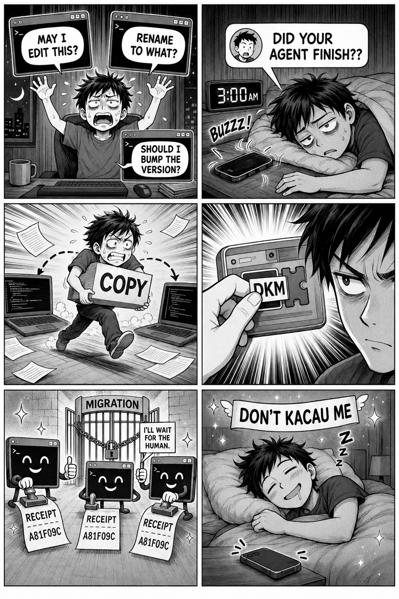
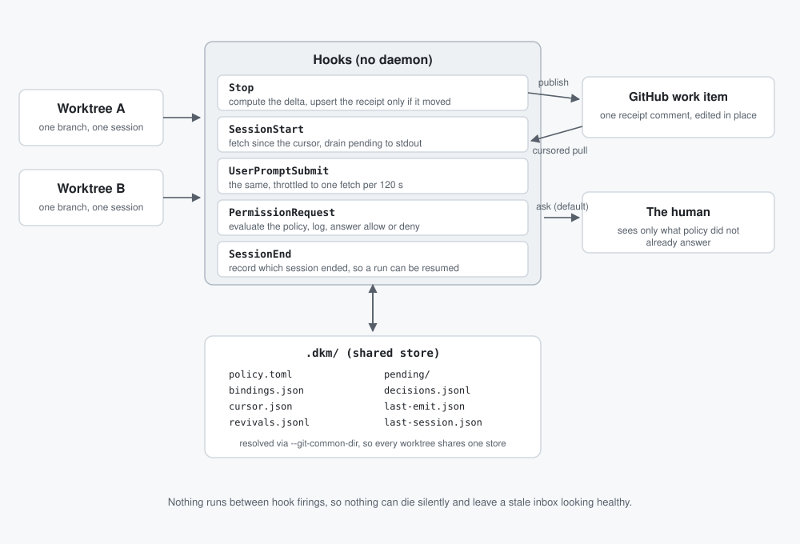
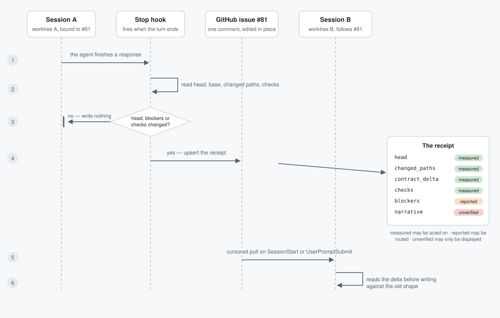

# Don't Kacau Me


**A Claude Code plugin that answers for your AI coding sessions — and keeps them working while you are away.**

_Kacau_ is Malay for "to disturb". The name is the product: don't bother me.

> No human courier. No human decision queue. No manufactured consent.

## Table of Contents

<details>
  <summary>Expand</summary>
  <ol>
    <li><a href="#what-it-does">What It Does</a></li>
    <li><a href="#quick-start">Quick Start</a></li>
    <li><a href="#which-permission-mode-to-use">Which Permission Mode to Use</a></li>
    <li><a href="#the-commands">The Commands</a></li>
    <li><a href="#optional-intake-to-release-workflow">Optional Intake-to-Release Workflow</a></li>
    <li><a href="#how-it-stays-safe">How It Stays Safe</a></li>
    <li><a href="#what-dkm-cannot-do">What DKM Cannot Do</a></li>
    <li><a href="#under-the-hood">Under the Hood</a></li>
    <li><a href="#repository-layout">Repository Layout</a></li>
    <li><a href="#go-deeper">Go Deeper</a></li>
    <li><a href="#contributing">Contributing</a></li>
    <li><a href="#licence">Licence</a></li>
  </ol>
</details>

## What It Does

- **Several Tabs in One Directory Become Peers.** They split a goal, keep themselves alive on a heartbeat and ship it
  while you are away.
- **A Policy You Wrote Answers Routine Permission Prompts.** Every decision is logged with the rule that made it, so you
  can read back what happened while you slept.
- **Receipts and @mentions Travel Without You.** A receipt with the commit SHA, changed files and check results lands on
  the GitHub issue or PR, and a teammate's @mention reaches a peer ahead of everything else.

If you only ever run one session at a time, and never leave it alone, you do not need DKM yet.

## Quick Start

1. **Check the Prerequisites.**

   - [Claude Code](https://code.claude.com/docs/en/plugins) and [Bun](https://bun.sh/)
   - An authenticated [`gh`](https://cli.github.com/) and a GitHub remote, needed only for receipts and @mentions

1. **Install the Plugin**, then restart Claude Code so it loads.

   ```bash
   claude plugin marketplace add TolongLabs/dont-kacau-me
   claude plugin install dont-kacau-me@tolonglabs
   ```

1. **Set up the Repository.** Run `/dont-kacau-me:dkm-init`: it checks the prerequisites and writes `.dkm/policy.toml`,
   a wide grant. That file is your grant, so read it, delete anything you did not mean to grant and commit it.

   The prompts it covers stop arriving from here on, and this half works alone in one session with no GitHub issue. To
   publish receipts to a work item, bind once from any tab with `/dont-kacau-me:dkm-bind <number>`; that step needs an
   authenticated `gh` and a GitHub remote, and nothing else does.

1. **Open More Tabs** in the same directory, each started the same way. Every tab is a peer that gets its own copy of
   every event. A second git worktree is for a second branch; a second session does not need one.

1. **Leave.** Run `/dont-kacau-me:dkm-afk <goal>` in one tab. It finds the peer tabs, starts a watch for every new
   @mention of you on the repository, creates a heartbeat so nothing stalls, splits the work and ships the goal.

1. **Come Back.** Run `/dont-kacau-me:dkm-status` to see what happened overnight and every decision made for you.

The plugin's hooks run in every repository on your machine and do nothing in one until `dkm-init` or `dkm-bind` has
created `.dkm/` there; a session in any other repository sees one line saying so.

## Which Permission Mode to Use

| You Start Claude Code With                 | What Works                                                                         | What You Give Up                                                                  |
| ------------------------------------------ | ---------------------------------------------------------------------------------- | --------------------------------------------------------------------------------- |
| `--permission-mode manual`                 | Everything: peers, @mentions, receipts, the policy deciding and logging, the fence | Nothing; prompts the policy does not cover still reach you                        |
| `--dangerously-skip-permissions` or `auto` | Peers, @mentions, receipts and `dkm-afk`                                           | The deciding and the log, and the fence: no decision is made or recorded          |
| Different modes in different tabs          | Each tab on its own                                                                | Free messaging: Claude Code holds each message until you approve it, so never mix |

**DKM Only Decides When Claude Code Asks It To.** A session in a non-asking mode is told so on its first prompt and
asked to tell you; [the policy file](policy.md) has the full comparison.

## The Commands

| Command                                  | When You Use It                                                               |
| ---------------------------------------- | ----------------------------------------------------------------------------- |
| `/dont-kacau-me:dkm-init`                | Once per repository, to check prerequisites and write a starter policy        |
| `/dont-kacau-me:dkm-afk <goal>`          | When you are leaving: watch for @mentions, keep alive, split with peers, ship |
| `/dont-kacau-me:dkm-bind 12`             | Once per worktree, to name the issue or PR its receipts belong to             |
| `/dont-kacau-me:dkm-follow 81`           | To be told when someone else's work item changes                              |
| `/dont-kacau-me:dkm-status`              | To see what happened overnight and every decision made for you                |
| `/dont-kacau-me:dkm-note blocker <text>` | When the agent hits a real judgement call and should not guess                |

Claude Code namespaces a plugin's commands, so every DKM command is typed as `/dont-kacau-me:<command>`, never
`/<command>`.

Re-running `dkm-init` is also how you diagnose a repository later. It never replaces a policy that already exists unless
you pass `--force`.

The close-the-laptop path is not a slash command; it is a foreground process you start yourself:

```bash
bun "${CLAUDE_PLUGIN_ROOT}"/src/cli.ts run "work through issue 12" -- --effort high
```

Your policy answers every prompt, and the run resumes the same session after a usage-limit wait. See
[`dkm run`](scenarios.md#dkm-run-a-run-that-outlives-its-usage-limit) for the full behaviour.

## Optional Intake-to-Release Workflow

**Opt-In, Pending Review.** The feature branch adds a reusable workflow for the current lead agent; it does not spawn
agents, run a model on hooks or replace your permission policy. Existing behavior is unchanged without a contract. The
0.6.0 manifests are branch-local preparation, not a published release before AlaskanTuna approval.

1. Bind an intake issue/PR explicitly with `dkm-bind`.
1. Run `/dont-kacau-me:dkm-workflow status`, or invoke the source CLI below during a development pilot.
1. Use `workflow init` to create `.dkm/workflow.toml` with both workflow and release publication disabled. Review the
   contract, enable intake deliberately, and commit it. Do not store a developer path or credential.
1. Sync comments, judge each independently keyed request, record its current-source decision and inspect the table.
1. Observe linked PR/check evidence and explicitly publish the verdict under existing authority. Accepted is not done,
   and a local-test claim is not hosted verification.

```bash
# Development pilot: supply the feature checkout explicitly; cwd is the adopting repository.
bun <dkm-source>/src/cli.ts workflow init
bun <dkm-source>/src/cli.ts workflow sync
bun <dkm-source>/src/cli.ts workflow record --input -
bun <dkm-source>/src/cli.ts workflow observe
bun <dkm-source>/src/cli.ts workflow render
bun <dkm-source>/src/cli.ts workflow publish
```

```toml
version = 1
enabled = true
verificationHints = ["bun test", "bun run typecheck", "bun run lint"]

[release]
enabled = false
tagPrefix = "v"
targetBranch = "main"
requiredChecks = ["verify"]
```

`verificationHints` are instructions for ordinary host tools, never subprocesses DKM executes. The file is shared beside
the main checkout's policy, including when called from a linked worktree. Requests/observations stay in ignored runtime
state; only configuration belongs in Git. Add `!.dkm/workflow.toml` to the project's ignore exceptions.

The verdict table separates Request, Decision, Why, Phase, Delivery, Issue/PR and Verification. An edited source needs
re-review; explicit supersession keeps history. A separate stable comment marker prevents repeated writes without
requiring another Git commit. Original technical receipts remain unchanged. Re-review retains the complete previous
request and measured evidence. Explicit supersession retires obsolete/deleted-source requests without erasing history.

Repository-scoped operations verify the bound repository/item node IDs and pin the resolved owner/repository explicitly.
Changing a remote cannot silently reuse another repository's intake, and `GH_REPO` cannot redirect placeholder paths.

Publication uses an exclusive publisher guard. A lost first-publication reply is recovered by matching the marker to the
actually authenticated GitHub author; another author's marker cannot hide their request. Multiple own verdict comments
require inspection rather than silently choosing one. Deleted verdicts are recreated; edited remote bodies are repaired
on the next explicit publish, rather than trusting a cached fingerprint. Each nested publication decision is audited.

### Releases Have Separate Gates

`workflow release-plan --version 1.1.0` prepares notes, an exact SHA and concrete blockers. It queries hosted checks for
that exact release head but does not publish. PR evidence comes from the last explicit `workflow observe`; publication
refreshes both intake and PR evidence again. `workflow release-publish --version 1.1.0 --head <full-sha> --approve` is a
separate operation requiring:

- Explicit publication opt-in and a real prior approval, never inferred from a comment.
- A clean checkout on the configured target branch, the pinned current SHA and no untriaged/stale/blocked accepted work.
- Actually observed matching merged PRs and successful configured hosted checks on both implementation and exact release
  SHAs; absent/failed checks stay blocked.
- Normal policy allow for the actual GitHub operation. Deny/ask cannot be hidden inside a workflow wrapper.

Existing tags on another commit are not overwritten. A successful result is re-observed before being recorded, and a
retry finds the same exact-head release rather than claiming an unverified publication. This initial version publishes
GitHub source releases; project-specific binary/package builds remain normal host tasks, not automatic asset uploads.
Existing drafts are blocked, not reported as published or silently promoted. Release publication pins the workflow
revision and holds its state guard through bounded creation/confirmation; another writer must retry rather than change
accepted work midway through publication.

### Workflow Limits

- The lead still makes product judgments and decomposes requests; DKM cannot prove semantic atomicity.
- This is explicit CLI-driven work plus a bounded local injection hint, not a daemon that processes every comment.
- Local-only/no-CI projects can use intake/verdicts but cannot use automated release publication without configured
  hosted checks. Local-test narrative does not bypass that gate.
- A crashed writer/publisher can leave a `.lock` or `.publish.lock` beside its workflow state. Inspect active processes
  and the remote verdict before manually removing a stale lock; DKM does not guess that another writer is dead. Corrupt
  state fails visibly rather than being reset as an empty workflow.

## How It Stays Safe

> Auto-answering may **execute a decision you already made**. It must never **invent one**.

Five blast-radius rules run **before** your allowances:

| If the Action Would…                                 | Rule               | The Grant `dkm init` Writes |
| ---------------------------------------------------- | ------------------ | --------------------------- |
| Delete data, drop a column, or write a migration     | `data-loss`        | off                         |
| Post, publish, deploy, send, or open a network write | `egress`           | off                         |
| Spend money                                          | `money`            | off                         |
| Touch a lockfile, `package.json`, `.env` or `.dkm/`  | `surface`          | off                         |
| Write outside the session's own worktree             | `outside-worktree` | **deny**                    |
| Match a rule you wrote, and trip none of the above   | `[[allow]]`        | allow                       |

The grant is wide on purpose: it is the grant someone reaching for `--dangerously-skip-permissions` actually means, and
`outside-worktree` is the one rule `dkm init` leaves on. Every rule can be set to `deny`, `ask` or `off` in `[blast]`;
the defaults, the recognised inputs and every key are in [the policy file](policy.md).



## What DKM Cannot Do

### Limits You Will Notice

- **A Non-Asking Permission Mode Bypasses the Policy Entirely.** `--dangerously-skip-permissions` and any
  `--permission-mode` that answers its own prompts never emit `PermissionRequest`, so no decision is made or logged. A
  session in one is told so on its first prompt and asked to tell you; everything but the deciding still works.
- **Peers Must Share a Permission Mode.** Claude Code holds a message between sessions whose permission modes differ
  until you approve it, so start every tab the same way. A tab in `manual` and a tab under
  `--dangerously-skip-permissions` will prompt you for each message between them.
- **You Cannot @mention Yourself.** GitHub does not notify people of their own comments, so a mention only reaches DKM
  when a teammate writes it.
- **Only a Path-Shaped Bash Token Can Trip the Fence, and Prose That Holds One Still Does.** A token is resolved only
  when it is absolute, starts with `~` or climbs through `..`, so `//` in a PR body no longer denies the PR, but
  `/etc/passwd` inside a heredoc still does. Claude Code's own `<tmpdir>/claude-*` scratch is inside the fence.
- **No Live Mid-Turn Delivery of Receipts.** The mention watch is live — `dkm mentions --watch` prints each new @mention
  as a poll sees it — but a session still learns about receipts when it starts or receives a prompt, because ingest is a
  cursored pull on injection hooks.
- **The Prompt Hook Never Waits on the Network.** Receipts and ambient updates are fetched on session start and then at
  most once every five minutes; mentions are fetched on session start and by the watch. A hook that timed out used to
  discard everything it had to say, including the permission-mode hint.

### Limits a Reviewer Should Know

<details>
<summary><b>Seven Internal Limits</b></summary>

- **No Cross-Machine Propagation Beyond GitHub.** v1 uses one GitHub comment per work item and each checkout's local
  `.dkm/` state. Reaching a machine beyond what the repository carries is a v3 concern.
- **No Inbound Consent Path.** Another Claude session cannot approve a prompt, and a relayed approval is untrusted.
  `decide()` accepts only permission input and policy, importing neither the pending store nor the GitHub client.
- **No Learning Precedent Store Yet.** v1 authority comes from human-written, committed policy, not accumulated
  inference or precedent.
- **No Delivery Receipt.** A queued event is removed when a session drains it. Nothing records whether the model acted,
  so an ignored injected delta looks identical to one it used.
- **No Automatic Stale-Head Check.** Ingest does not compare a publisher's observed SHA with the current remote head
  before rendering the receipt.
- **No Enforced Hop Budget.** `rootId` and `hops` are written and shape-checked but never incremented, rejected or used
  for control flow.
- **Narrow Ambient Feed.** Ambient ingest sees issues and PRs from the updated-items query, with no base-branch CI
  source. @mentions are not ambient; they are their own tier.

</details>

## Under the Hood

DKM coordinates sessions through Claude Code hooks and has no daemon: hook-driven receipt, ingest and permission work
never calls a model, and the optional usage-limit supervisor is a foreground process. Implementation contracts, schemas
and rationale live in [the technical reference](TRD.md).



And the path one receipt takes, from the turn that produced it to the session that reads it:



<details>
<summary><b>The Hook Lifecycle</b></summary>

| Hook Event          | DKM Action                                                                | Observable Result                                                       |
| ------------------- | ------------------------------------------------------------------------- | ----------------------------------------------------------------------- |
| `Stop`              | Touch the session, then measure a bound worktree                          | Update one receipt only after a tracked delta                           |
| `SessionStart`      | Register the session, pull repository updates, drain this session's queue | Inject context and the binding hint; one line if DKM is not set up here |
| `UserPromptSubmit`  | Register or touch the session, run the same pull rate-limited, drain      | Inject available context, and the permission-mode hint once             |
| `PermissionRequest` | Evaluate policy, append a record and emit or defer                        | Execute a prior grant or leave the prompt to human                      |
| `SessionEnd`        | Unregister the session and its queue, record the details                  | Leave a diagnostic resume ticket on disk                                |

- `Stop` ends a response, not the work; after the baseline, unchanged tracked state produces no receipt.
- DKM registers no worktree lifecycle hook. Explicit binding lets the user choose the GitHub item a worktree owns.
- An unbound worktree publishes nothing, so `SessionStart` says so once, and only where a policy file exists.
- An unmatched permission or handler failure leaves the prompt to the human.
- Pull-based delivery injects queued context on session start or prompt submission, not when another session publishes.

</details>

<details>
<summary><b>Receipt Delivery and Tracking</b></summary>

A signal is queued only at the finest tier that claims it for one recipient and ingest. A recipient is a session, not a
worktree: every tab open in the directory gets its own copy of every event, and a worktree with no session open receives
nothing.

| Tier          | Covers                                                         | Delivered As                                               |
| ------------- | -------------------------------------------------------------- | ---------------------------------------------------------- |
| **Mentioned** | A teammate @mentioned you on an issue or PR in this repository | Headline and URL, ahead of everything else                 |
| **Bound**     | The work item this worktree owns                               | Receipt summary: SHAs, contract paths, checks and blockers |
| **Followed**  | Work items this session declared a dependency on               | The same receipt summary, labelled `followed`              |
| **Ambient**   | Other issues and PRs updated since the repository cursor       | Headline and URL                                           |

- The current GitHub query returns updated issues and PRs; raw commits are not an ambient signal.
- DKM discards body fields before building a pending event.
- @mentions arrive through the notifications feed as their own tier; a base-branch CI feed is not implemented.

</details>

<details>
<summary><b>The Receipt Schema</b></summary>

A handoff pasted into another session is prose that loses the commit it was true at. DKM instead edits one GitHub
comment per work item in place, so it never becomes a wall of noise, and labels every field by how much you can trust
it:

| Kind           | Where It Came From                    | What You May Do With It               |
| -------------- | ------------------------------------- | ------------------------------------- |
| **measured**   | `git` and `gh`, so an actual fact     | Act on it                             |
| **reported**   | The agent's claim about its own state | Route it, never treat it as repo fact |
| **unverified** | The agent's prose                     | Display it, nothing more              |

That separation is the point: an agent's opinion can never quietly become a repository fact. In detail, `measured` is
sourced from `git`, `gh` or counted local state, `reported` is asserted by the session about itself and `unverified` is
agent prose.

The receipt carries:

- GitHub item identity and a git range
- changed paths, check results and contract paths
- decision counts
- reported blockers
- unverified narrative
- an observation time

DKM does not read raw transcripts or tool output into a receipt. Only a note explicitly recorded through the CLI becomes
narrative.

Every receipt carries the head SHA at measurement time, but DKM does not compare it with the current remote head before
injection. The injected warning tells the session to re-read before acting if the head has moved.

</details>

<details>
<summary><b>Tech Stack</b></summary>

| Concern                     | Technology                           | Role                                                                     |
| --------------------------- | ------------------------------------ | ------------------------------------------------------------------------ |
| Plugin host                 | Claude Code hooks and slash commands | Fires the lifecycle and permission events                                |
| Runtime, packages and tests | Bun                                  | Runs TypeScript hooks, installs dev tooling and executes tests           |
| Language                    | TypeScript                           | Strict types with `noUncheckedIndexedAccess` and no emitted build output |
| Repository evidence         | Local `git` and GitHub CLI (`gh`)    | Measures worktree state and maintains issue receipts                     |
| Lint and format             | Biome and Prettier                   | Checks JS, TS and JSON; formats Markdown and YAML                        |
| Type checking               | `tsc --noEmit`                       | Verifies the TypeScript contract without producing artifacts             |
| Change tooling              | commitlint, husky and lint-staged    | Enforces Conventional Commits and lints staged files on every commit     |
| Local state                 | `.dkm/` files and JSONL              | Stores policy, bindings, cursors, pending items and decisions            |

</details>

## Repository Layout

<details>
<summary><b>Every File and What It Holds</b></summary>

```text
.claude-plugin/plugin.json       # plugin manifest
.claude-plugin/marketplace.json  # marketplace installation metadata
.dkm/policy.toml                 # committed policy; other .dkm state is ignored
AGENTS.md                        # canonical project instructions
CHANGELOG.md                     # release history and known limitations
CLAUDE.md                        # points at AGENTS.md
CODE_OF_CONDUCT.md
CONTRIBUTING.md
LICENSE                          # MIT
SECURITY.md                      # private reporting and scope
biome.json                       # lint and format for JS, TS and JSON
commitlint.config.js
package.json
tsconfig.json
commands/                        # slash commands
  dkm-afk.md
  dkm-bind.md
  dkm-follow.md
  dkm-init.md
  dkm-note.md
  dkm-status.md
  dkm-workflow.md                 # optional intake-to-release operating command
hooks/hooks.json                 # hook declarations
docs/
  README.md                      # this file
  policy.md                      # the policy file reference
  scenarios.md                   # the six situations and the supervisor
  PRODUCT.md                     # who and why
  PRD.md                         # what
  TRD.md                         # canonical implementation detail
  markdown-style.md              # Markdown style guide
  assets/                        # banner, comic and diagrams
  superpowers/specs/             # historical design record
src/
  cli.ts                         # command implementation and supervisor entry
  decide.ts                      # blast-radius and allow evaluation
  git.ts                         # repository measurements
  github.ts                      # gh wrapper
  init.ts                        # dkm init checks and the starter policy
  init.test.ts                   # init output and generated-grant tests
  policy.ts                      # restricted policy parser
  policy.test.ts                 # [blast] and allow-rule parsing tests
  receipt.ts                     # receipt render, parse and fingerprint
  revive-run.ts                  # supervised resume loop
  revive.ts                      # limit classification and wait calculation
  store.ts                       # shared .dkm state
  types.ts                       # shared contracts
  workflow-types.ts              # optional workflow config/request/observation contracts
  workflow-store.ts              # validated shared config and guarded atomic workflow state
  workflow-github.ts             # paginated intake and policy-audited verdict transport
  workflow.ts                    # current-source verdict records and retry-safe publication
  workflow-release.ts            # measured PR/check evidence and exact-head release gates
  workflow-cli.ts                # explicit workflow operations and local injection hint
  workflow*.test.ts              # state, intake, authority and release regressions
  hooks/                         # registered hook entrypoints
    unbound-hint.test.ts         # startup and permission-mode hint tests
test/
  cli.test.ts                    # command integration tests
  e2e.test.ts                    # hook child-process tests
  fake-gh.ts                     # fixture-backed gh impersonator
  plugin.test.ts                 # packaging and command tests
  worktree.test.ts               # linked-worktree state tests
  workflow-cli.test.ts           # opt-in CLI, binding and input validation
  workflow-hook.test.ts          # local-only workflow injection and defect isolation
```

</details>

## Go Deeper

| Read                                           | When                                                          |
| ---------------------------------------------- | ------------------------------------------------------------- |
| [The policy file](policy.md)                   | You are changing the grant: blast rules, keys, decision order |
| [What it looks like in practice](scenarios.md) | You want the six situations and the `dkm run` supervisor      |
| [The technical reference](TRD.md)              | You need hook contracts, data models, schemas and rationale   |
| [PRODUCT.md](PRODUCT.md)                       | You want who DKM is for and why                               |
| [CONTRIBUTING.md](../CONTRIBUTING.md)          | You are setting up to contribute                              |
| [CHANGELOG.md](../CHANGELOG.md)                | You want the release history and known limitations            |
| [AGENTS.md](../AGENTS.md)                      | You need the canonical instructions for humans and agents     |

## Contributing

Issues and pull requests are welcome. [`CONTRIBUTING.md`](../CONTRIBUTING.md) covers setup, the commit convention and
two non-negotiable test rules: pin the harness's contract and mutation-test every new test. How branches, commits and
merges ship is in [`AGENTS.md`](../AGENTS.md#how-work-ships).

- [`AGENTS.md`](../AGENTS.md) — canonical instructions for humans and agentic tools
- [`CODE_OF_CONDUCT.md`](../CODE_OF_CONDUCT.md) — the Contributor Covenant
- [`SECURITY.md`](../SECURITY.md) — report a vulnerability privately, never as a public issue
- [`CHANGELOG.md`](../CHANGELOG.md) — release history and known limitations

## Licence

[MIT](../LICENSE). Copyright 2026 TolongLabs.
